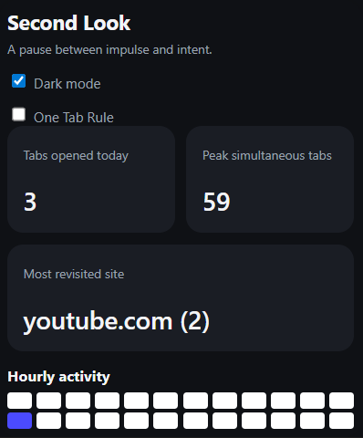
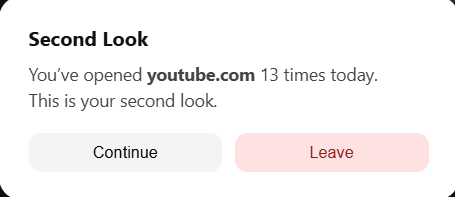
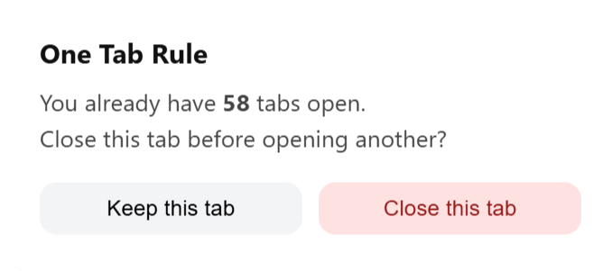

# Second Look 👀 - A pause between impulse and intent.

  

Second Look is a focus-first, lightweight Chrome extension that helps you browse more intentionally by tracking how often you open certain websites and preventing tab overload. 🚀

Instead of blocking sites outright, it gives you a second look — a gentle nudge that makes you pause and think before opening the same site again.
It helps you become more aware of your browsing habits by adding small, intentional pauses before reopening distracting sites.

> **Notice → Reflect → Decide**

## 🧠 Why this exists

We don’t always realise how often we reopen the same tabs — social media, docs, dashboards, videos.
### Second Look:

- Makes your browsing habits visible
- Reduces duplicate tabs
- Encourages mindful decision-making, not restriction

### Second Look is built on a simple idea:
> **Awareness beats restriction.**

## ✨ Features

- 🧭 First-Run Onboarding – First-run welcome experience and clean transition into the dashboard

- 🔢 Site open counter — tracks how many times you open a site, and that's where Second Look steps in and asks you to pause and decide - Continue browsing or Leave and go back

- ⏰ Snooze for 1 Hour — Avoid repeated prompts by pausing interventions for the next hour on a site

- 🚫 One-tab rule — prevents opening duplicate tabs of the same site

- 📊 Usage Dashboard — gives you a clear snapshot of your day: Tabs opened today, Peak simultaneous tabs, Most revisited site, and Hourly activity heatmap

- 🟢 Focus Ring — Visual, real-time indicator of focus level.    
  Colour-coded states:
  - Cyan → strong focus
  - Purple → mixed attention
  - Pink → high distraction

- 🧠 Focus Score – **Focus Score (0–100)** based on real behavior and quantifies how focused your browsing sessions are.

- 🏷️ Automatic Site Classification – Websites are categorised automatically.

- 🪶 Lightweight & fast — no tracking servers, all local

- 🔒 Privacy-friendly — data stays in your browser

## 📸 Screenshots

### Site Visit Prompt
A gentle nudge when a site has been opened multiple times.

### One-Tab Rule Mode
Prevents opening duplicate tabs for the same site.

## 🛠️ How it works

- Uses Chrome’s tabs and storage APIs
- Tracks site opens per domain
- Injects logic via content.js
- Stores all data locally using chrome.storage

No accounts. No cloud. No analytics.

## 🚀 Installation

1. Clone or download this repository
2. Open Chrome and go to `chrome://extensions`
3. Enable **Developer Mode** (top-right)
4. Click **Load unpacked**
5. Select the project folder

Second Look will appear in your toolbar.

## 🧪 Current Status

Feature-frozen for now.

## 🛠 Tech Stack

- Vanilla JavaScript
- Chrome Extensions API (MV3)
- HTML / CSS

## 🔒 Privacy

Second Look:
- Does not collect personal data
- Does not send data to any server
- Works entirely offline
- Stores all data locally in your browser

You own your data. Period.

## 📄 License

This project is licensed under the MIT License. 

## 📦 Versioning
**Current version:** `2.0.0`

This release introduces onboarding, focus intelligence,
behavioral nudges, and a complete visual redesign.

##

Second Look doesn’t block distraction.
It makes you aware of it.

That awareness is the product.

> **Built with ❤️ for deep focus.**
